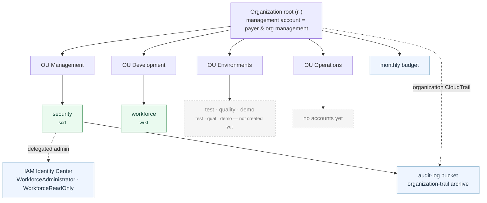

# AWS Organization

The shape of the Organization and the fixed inputs every stack reads. Current state, not a plan.

## Shape

## Accounts and OUs

The four top-level OUs sit under the root (`live/management/organization.tf`). The management (payer) account is at the root itself, never inside an OU. Each account has a unique four-letter key used in resource names (`scripts/environment-keys.tsv`).

| OU | Account | Key | Role |
|---|---|---|---|
| — (root) | management | `root` | Payer and Organization management; runs the `live/management` stack. |
| Management | security | `scrt` | Identity Center delegated admin; audit-log archive. |
| Development | workforce | `wrkf` | Runs the developer agents. |
| Environments | test, quality, demo | `test`, `qual`, `demo` | App environments. Accounts not created yet. |
| Operations | — | — | Reserved; no accounts yet. |

## Region

One allowed region: **`eu-south-1`** (Milan). It is the region of the state bucket, the Identity Center instance and the `AWS_REGION` variable of the `management` / `management-plan` environments.

Single region on purpose: Identity Center's home region cannot move and the region-deny SCP must always allow it; Bedrock serves the Claude models there; data stays in the EU. A second region would be a new decision that also puts the region into the (global) IAM names.

## Guardrails (SCPs)

Four baseline policies are defined in `modules/scp-baseline`. **The module attaches nothing** — attachment to the OUs is a separate, staged, maintainer-approved step and has not run yet. Every statement is a `Deny`.

| Policy | Denies |
|---|---|
| `deny-leave-organization` | `organizations:LeaveOrganization` on member accounts. |
| `deny-root-user` | Everything for a member account's root user (assumed-root recovery still works). |
| `deny-disable-cloudtrail` | Stopping, changing or deleting CloudTrail trails and event data stores. |
| `deny-outside-allowed-region` | Every action outside `eu-south-1`, except global-service prefixes (below). |

One hand-made SCP, `DenyLeaveAndCloseAccount`, is attached to the root by hand and denies `organizations:LeaveOrganization` and `account:CloseAccount`. SCPs never apply to the management account.

Before `deny-outside-allowed-region` is attached, it must be validated against Bedrock cross-region inference: a routed `eu.`/`global.` request executes in another region, so either the models are called in-region only or the destination regions are allowed for Bedrock through a condition-narrowed `Deny`.

### Global-service exceptions

`deny-outside-allowed-region` exempts services that are global or served from `us-east-1`, as an explicit list of prefixes (`NotAction` in a `Deny`, narrowed by `aws:RequestedRegion`), asserted literally in the module's test. A prefix is added only in the PR that needs it.

| Area | Prefixes |
|---|---|
| Identity and access | `iam`, `sts`, `organizations`, `account`, `identitystore`, `sso`, `sso-directory` |
| Billing and cost | `budgets`, `ce`, `cur`, `billing`, `payments`, `tax`, `pricing`, `freetier`, `consolidatedbilling`, `aws-portal` |
| Support and health | `support`, `trustedadvisor`, `health` |
| Global edge and DNS | `route53`, `route53domains`, `cloudfront`, `globalaccelerator`, `waf`, `shield` |

## Account emails

One mailbox, plus-addressed per account: `<local>+<account>@<domain>` (`management`, `security`, `workforce`, later `test`, `quality`, `demo`). AWS needs a unique address per account; a plus-address delivers to the one mailbox, so there is nothing to administer per account and all root-recovery mail lands in one place.

The base address is the secret `ACCOUNT_EMAIL_BASE`; Terraform receives it through `TF_VAR_account_email_base` and builds each address with `format("%s+%s@%s", local, account, domain)`. The variable is `sensitive`, validated for the `local@domain` shape and the absence of a `+`; `scripts/redact.sh` strips emails from logs and PR comments. The Organization stack sets `email` once and ignores later changes (the Organizations API cannot change it).

## Inputs: where each value lives

| Value | Kind | Location | Read by |
|---|---|---|---|
| Region | variable | `AWS_REGION` in `management`, `management-plan` | workflow, as `TF_VAR_region` |
| Global-service exceptions | code | `modules/scp-baseline`, with a literal test | Terraform |
| Account email base | secret | `ACCOUNT_EMAIL_BASE` in `management` | apply job, as `TF_VAR_account_email_base` |
| Organization root ID | secret | `ORGANIZATION_ROOT_ID` in `management`, `management-plan` | plan and apply jobs, as `TF_VAR_root_id` |
| Role ARNs, state bucket | secret | `AWS_ROLE_ARN`, `AWS_ROLE_ID`, `STATE_BUCKET` | workflow (`docs/BOOTSTRAP.md`) |
