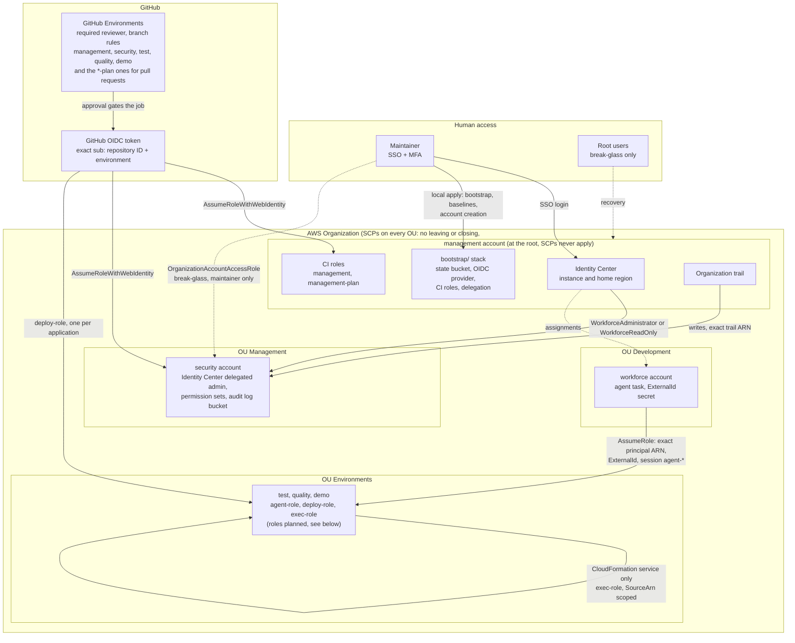

# Security diagram

One picture of who can reach what: people, CI and the developer agent, and the guardrails around them. It summarizes the decisions of the documents linked below and never replaces them: when they differ, the linked document is right and this one is wrong.

Solid arrows are normal paths, dashed arrows are break-glass or one-off.

## What the diagram says

- **No long-lived keys.** CI authenticates with GitHub OIDC. The trust names one exact subject (repository ID and GitHub Environment), never a wildcard (`docs/GITHUB_CI.md`, `docs/BOOTSTRAP.md`).
- **The branch rule is not in AWS.** The subject carries the environment but no branch, so which branch or tag may use an environment is a setting of the GitHub Environment, defined in `workforce-github` (`docs/ENVIRONMENT_PERMISSIONS.md`).
- **Agent path.** The agent task in `workforce` assumes the agent role of an environment account. The trust needs the exact principal ARN, the ExternalId and a session name `agent-*` (`docs/ENVIRONMENT_PERMISSIONS.md`, `docs/CROSS_ACCOUNT_ROLES.md`).
- **Deploy path.** The application repository reaches the same account through its own deploy role, and CloudFormation then applies through an execution role that only the CloudFormation service can assume.
- **Humans have one door.** SSO with MFA through Identity Center, administered from `security` (`docs/IDENTITY_CENTER.md`). The root user and `OrganizationAccountAccessRole` are break-glass.
- **Local only.** The bootstrap stack, the account baselines (the CI roles of each account), the Identity Center delegation and account creation are applied by the maintainer with SSO admin, so a CI role cannot widen itself (`docs/BOOTSTRAP.md`, `docs/ACCOUNT_CI_BASELINES.md`).
- **Guardrails.** The four baseline SCPs sit on the OUs, never on the root and never on `management` (`docs/GUARDRAILS_ROLLOUT.md`). Every API call is recorded by the Organization trail into a bucket in `security` that only the break-glass role can delete from (`docs/AUDIT_LOGGING.md`).

## Where the model relies on review, not IAM

- In `security`, CI can create permission sets and assign them to the maintainer in any member account. Only the maintainer's approval on the `security` environment and the pull request review stop it (`docs/IDENTITY_CENTER.md`, section 5).
- `management` CI holds `cloudtrail:UpdateTrail`, guarded by review and the `management` approval (`docs/AUDIT_LOGGING.md`).

## Not built yet

- The agent, deploy and execution roles of the environment accounts are a decision record (`docs/ENVIRONMENT_PERMISSIONS.md`). The role module exists (`docs/CROSS_ACCOUNT_ROLES.md`) but no stack uses it.
- The agent task and its ExternalId secret in `workforce` belong to the pipeline.
- The region SCP and Bedrock cross-region inference profiles are an open risk (`docs/GUARDRAILS_ROLLOUT.md`).
